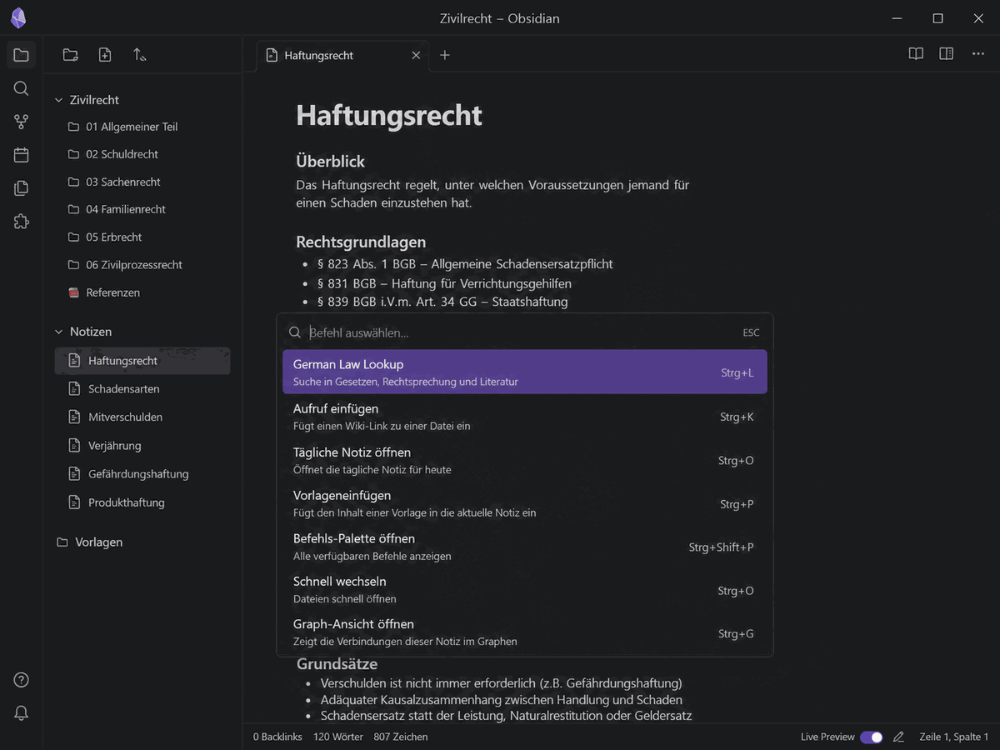

# German Law Lookup

Look up German federal law references in Obsidian, preview German or published English law text, and insert the formatted result into the active note.

## Demo



## Features

- Look up supported German federal law references directly from Obsidian.
- Preview retrieved law text before inserting it.
- Insert law text only after an explicit user action.
- Optionally include source, law reference, retrieval date, and cache metadata in the inserted note.
- Use German official law text as the default source.
- Optionally use published English law text from Gesetze im Internet for explicitly supported laws.
- Fall back to German official law text when English law text is unavailable or not configured.
- Follow the Obsidian interface language for plugin UI labels.

## Important limitations

- This plugin targets German federal law only.
- It does not support state law, EU law, case law, legal commentary, or legal advice.
- It never generates translations.
- English law text is used only when explicitly enabled and only from published Gesetze im Internet sources.
- German official law text remains the default source.
- Unsupported references are not inferred or approximated.

## Supported references

The plugin supports common section-based references, for example:

- `§ 823 BGB`
- `BGB 823`
- `823 BGB`
- `§ 242 StGB`
- `SGB V § 1`
- `§ 1 FreizügG/EU`

It also supports selected article references, for example:

- `Art. 1 GG`
- `GG Art. 1`
- `Art. 1 EGBGB`
- `Art. 229 § 6 EGBGB`

The complete supported-law list is shown in the plugin settings.

## Sources

The stable runtime provider uses published law text from [Gesetze im Internet](https://www.gesetze-im-internet.de/).

Gesetze im Internet HTML is the current validated provider path. Gesetze im Internet XML access has been technically validated, but XML extraction is optional future work and is not required for the current stable release.

NeuRIS is tracked as a future strategic provider once its public API, schema, and coverage are sufficiently stable.

## Privacy and network access

German Law Lookup retrieves law text from external public legal-information websites when a lookup is executed.

- The current stable provider path uses Gesetze im Internet.
- Network requests are made only for user-initiated lookups.
- The plugin sends the requested law reference to the configured provider in order to retrieve the matching law text.
- The plugin does not send note contents to external services.
- The plugin does not use AI services and does not generate translations.
- Optional English law text is retrieved only from published Gesetze im Internet sources where explicitly supported.
- Retrieved law text may be cached locally in the Obsidian vault/plugin data, depending on the plugin settings.

## Installation

For manual installation, copy the release files into:

```text
<your-vault>/.obsidian/plugins/german-law-lookup/
```

Required release files:

- `manifest.json`
- `main.js`
- `styles.css`

Then reload Obsidian and enable **German Law Lookup** under **Settings → Community plugins**.

## Usage

1. Open the command palette in Obsidian.
2. Run the law lookup command.
3. Enter a supported law reference, such as `§ 823 BGB`.
4. Review the preview.
5. Insert the result into the active note.

The plugin does not modify notes automatically.

## Development

Install dependencies:

```bash
npm install
```

Run tests:

```bash
npm test
```

Build the plugin:

```bash
npm run build
```

## Release files

A manual release should include:

- `manifest.json`
- `main.js`
- `styles.css`
- `versions.json` if publishing version compatibility metadata

Do not include `node_modules` in the release package.

## Disclaimer

This plugin is a research and productivity tool. It is not legal advice. Always verify legal texts against the official source before relying on them.
